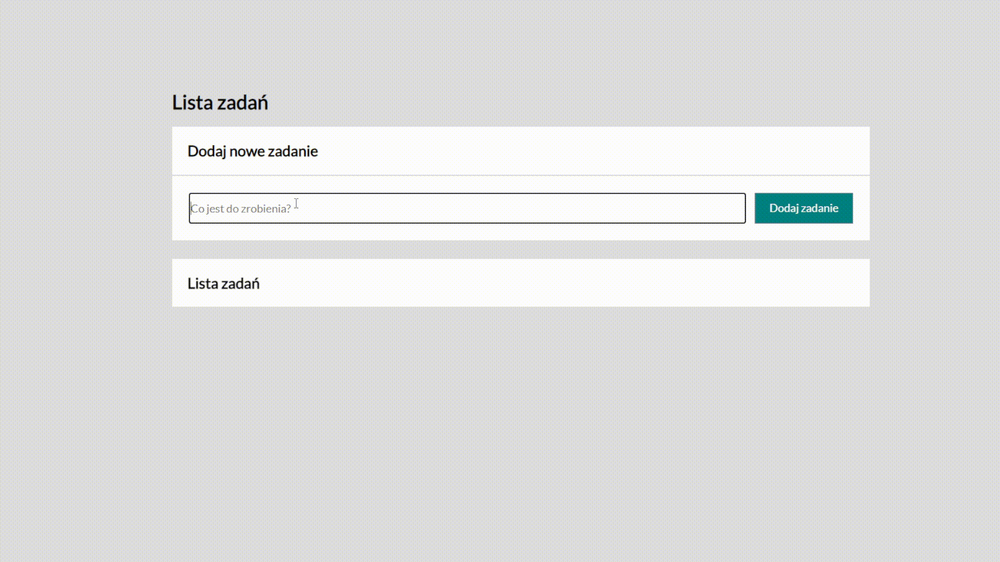

# Oskar Romanowicz - To Do List!

# DEMO: https://romvsss.github.io/toDoList/

## Description

This is a simple web application that allows you to add new tasks, mark them as done, or remove them. You can also mark all tasks as done and hide completed ones.

## Available Scripts

In the project directory, you can run:

### `npm start`

Runs the app in development mode.  
Open `http://localhost:3000` to view it in your browser.

The page will automatically reload if you make edits.

### `npm test`

Launches the test runner in interactive watch mode.

### `npm run build`

Builds the app for production to the `build` folder.  
It bundles React in production mode and optimizes the build for the best performance.

The build is minified, and the filenames include hashes.  
Your app is ready to be deployed!

## Technologies

- HTML5
- CSS3 (with BEM methodology)
- JavaScript (ES6+)
- React Hooks
- Create React App
- Styled-components
- Git & GitHub