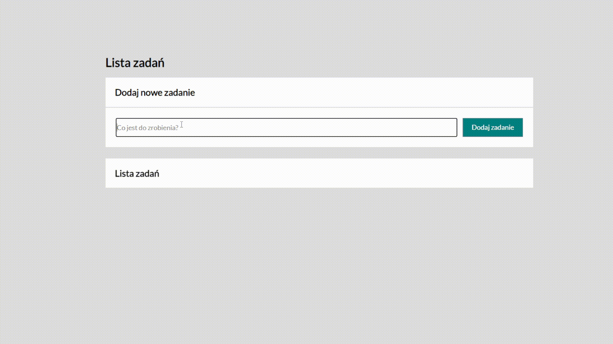

# Oskar Romanowicz - To Do List!

# DEMO: https://romvsss.github.io/to-do-list-react/

## Description

This is a To-Do List application built with React. It allows you to add new tasks, mark them as done, remove them, and hide completed tasks. 

The application features:
* **Routing** with separate pages for the task list, task details, and an author page (using `react-router-dom`).
* **Task filtering** based on URL search parameters.
* **Asynchronous fetching** of example tasks (using `redux-saga`).
* **Persistent state** with all tasks saved in the browser's Local Storage.

## Available Scripts

In the project directory, you can run:

### `npm start`

Runs the app in development mode.  
Open `http://localhost:3000` to view it in your browser.

The page will automatically reload if you make edits.

### `npm test`

Launches the test runner in interactive watch mode.

### `npm run build`

Builds the app for production to the `build` folder.  
It bundles React in production mode and optimizes the build for the best performance.

The build is minified, and the filenames include hashes.  
Your app is ready to be deployed!

## Technologies

-   HTML5
-   CSS3
-   JavaScript (ES6+)
-   React (Hooks)
-   React Router
-   Redux Toolkit
-   Redux Saga
-   Styled-components
-   Create React App
-   Git & GitHub